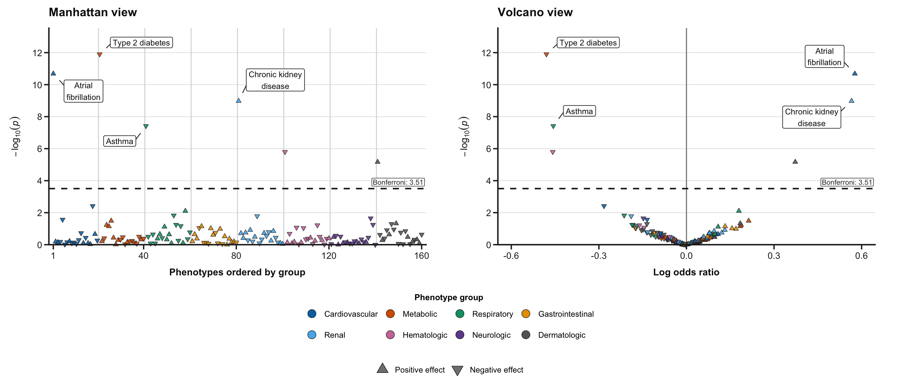

# phewasFlow

An R package from the [Fritsche Lab](https://fritschelab.github.io) at the
University of Michigan for reproducible phenome-wide association studies.

`phewasFlow` fits one planned association model across many clinical
phenotypes. It supports two common biomedical questions:

| Question | Direction |
|---|---|
| Is one PRS, exposure, or biomarker associated with many outcomes? | `phenotypes_as_outcomes` |
| Is each phenotype associated with one fixed clinical endpoint? | `phenotypes_as_predictors` |

Binary outcomes use Firth logistic regression, continuous outcomes use linear
regression, counts use negative-binomial regression, and ordinal outcomes use
proportional-odds regression. Every requested phenotype receives a result row,
including models that were skipped or failed.

## Install

Requires R 4.4 or later. From a downloaded or cloned package source directory,
install the package and its runtime dependencies:

```bash
Rscript -e 'install.packages("remotes", repos = "https://cloud.r-project.org")'
Rscript -e 'remotes::install_local(".", dependencies = NA, upgrade = "never")'
export PATH="$PWD/exec:$PATH"
phewasflow --help
```

The R functions work without adding the command-line wrapper to `PATH`.
For an optional conda environment using [environment.yml](https://github.com/FritscheLab/phewasFlow/blob/main/environment.yml):

```bash
mamba env create --file environment.yml
mamba activate phewasflow
R CMD INSTALL .
export PATH="$PWD/exec:$PATH"
```

Reinstall the package after changing the source. Neither installation method
requires a cluster account or access to lab data.

## Run the simulated example

This example asks whether a standardized simulated polygenic score is
associated with a diagnosis, quantitative measurement, healthcare-utilization
count, and ordered symptom level while adjusting for age and sex.

```bash
Rscript inst/examples/real-data/create-demo-project.R demo-phewas
cd demo-phewas
Rscript run-local.R analysis-forward.yml
```

The generated project contains 220 simulated participants and uses the same
file interface as a real analysis. It validates the inputs, runs two shards,
combines the associations, applies multiple-testing correction, and creates:

```text
phewasflow-output/forward/
  results.tsv
  results.rds
  phewas.png
  phewas.pdf
  phewas-volcano.png
  phewas-volcano.pdf
```

The generated data are for demonstration only, not scientific analysis.

A larger, separately simulated result set illustrates the two standard views.
Every point and association shown below is artificial and is not a clinical
finding.

Both views keep the same phenotype-group order, colors, legends, y-axis, and
annotation style. The Manhattan x-axis orders phenotypes by group; the volcano
x-axis shows the fitted effect.



This paired image is only a compact README preview. Analysis runs save the
Manhattan and volcano plots as separate files.

Open `phewas.png` or `phewas-volcano.png` for a quick review. The PDF versions
retain vector text and shapes for publication and post-editing. To try the
reverse direction, run:

```bash
Rscript run-local.R analysis-reverse.yml
```

## Use your data

Start from the generated project and replace three inputs:

- `inputs/analysis.rds`: one row per participant, with the anchor, covariates,
  and every scanned phenotype;
- the phenotype metadata TSV: one row per scanned phenotype, with `phenotype`,
  `description`, `group`, `groupnum`, and `color`; if the `variable_type`
  column is absent or its value is `NA` or blank, it defaults to `binary`,
  while `outcome_type` remains required when phenotypes are outcomes; and
- the YAML configuration: analysis direction, anchor, covariates, eligibility
  thresholds, output directory, and plot settings.

Keep an unavailable phenotype as `NA`, not as a control. For a scanned binary
phenotype, `reference` defaults to character `0` when it is missing, `NA`, or
blank; declare it when another value is the reference. A fixed binary anchor
still requires an explicit `anchor_reference` in the YAML. Ordinal phenotypes
need explicitly ordered levels.
Convert special missing-value codes to `NA`. Store categorical covariates as
RDS factors with explicit reference levels, or as K-1 numeric indicators in a
delimited file. Each YAML should define one fixed anchor and one testing family.
Phenotypes should already implement the intended observation window,
case/control definition, and exclusions; `phewasFlow` fits models but does not
derive phenotypes from raw clinical codes.

The [real-data workflow](https://fritschelab.github.io/phewasFlow/articles/real-data-workflow.html) gives the complete
participant-table and metadata requirements with working examples.

## Validate and run

Check the files and model specification before fitting:

```bash
phewasflow validate --config analysis-forward.yml
```

For a modest analysis, the generated runner performs every stage:

```bash
Rscript run-local.R analysis-forward.yml
```

For larger scans, use the [SLURM templates](https://github.com/FritscheLab/phewasFlow/tree/main/inst/examples/slurm) after
the same analysis succeeds locally on a representative phenotype set.

## Review the results

Start with `status` in `results.tsv`:

| Status | Meaning |
|---|---|
| `ok` | Model completed and was included in multiple-testing correction |
| `skipped` | Eligibility or estimability requirements were not met |
| `error` | Model preparation, fitting, or convergence failed |

Review `reason_code`, `message`, `warnings`, sample counts, and
`testing_family_size` before interpreting associations. `native_effect` is a
coefficient for continuous outcomes, an odds ratio for binary outcomes, an
incidence-rate ratio for counts, and a common odds ratio for ordinal outcomes.

The Bonferroni line is displayed by default. One plot command writes Manhattan
and volcano plots as both PNG and PDF. Both use the same ordered phenotype-group
legend and visual styling. Volcano coefficients are not directly comparable
across different effect measures or measurement units.

Completed matching shards are reusable after an interrupted run. Change the
`analysis_id` and output directory whenever the data, model, thresholds, shard
count, or package version changes.

## Learn more

- [Run a PheWAS with your data](https://fritschelab.github.io/phewasFlow/articles/real-data-workflow.html)
- [PheWAS in both directions](https://fritschelab.github.io/phewasFlow/articles/two-directions.html)
- [Comparisons and plots](https://fritschelab.github.io/phewasFlow/articles/comparisons-and-plots.html)
- [Scale a successful PheWAS](https://fritschelab.github.io/phewasFlow/articles/large-runs.html)
- [Run a sharded PheWAS with SLURM](https://github.com/FritscheLab/phewasFlow/tree/main/inst/examples/slurm)

## Development

Install the test and documentation dependencies once, then run the tests and
source-package checks:

```bash
Rscript -e 'remotes::install_deps(dependencies = TRUE, upgrade = "never")'
Rscript -e 'install.packages(c("pkgload", "rcmdcheck", "roxygen2"), repos = "https://cloud.r-project.org")'
R CMD INSTALL .
Rscript -e 'testthat::test_local()'
R CMD build .
R CMD check --no-manual phewasFlow_0.1.0.tar.gz
```

Reinstall before testing changes so parallel workers load the current package.
Building the vignettes requires Pandoc. The GitHub Actions workflow runs package
checks on Linux and Windows. See [CONTRIBUTING.md](CONTRIBUTING.md) for the
documentation build and release procedure.

## Support and citation

Maintained by Lars Fritsche. Report reproducible problems through
[GitHub issues](https://github.com/FritscheLab/phewasFlow/issues), using synthetic
examples and sanitized logs. Keep participant data, credentials, and local
analysis configuration outside this repository. Even aggregate results and
provenance files require review before sharing.

Use `citation("phewasFlow")` from R or the repository's
[citation metadata](https://github.com/FritscheLab/phewasFlow/blob/main/CITATION.cff), and record the package version in your work.
The included examples are simulated; this is research software and is not a
clinical or diagnostic tool.

## License

Publication and redistribution remain pending an approved license and copyright
statement; see [LICENSE](https://github.com/FritscheLab/phewasFlow/blob/main/LICENSE).
